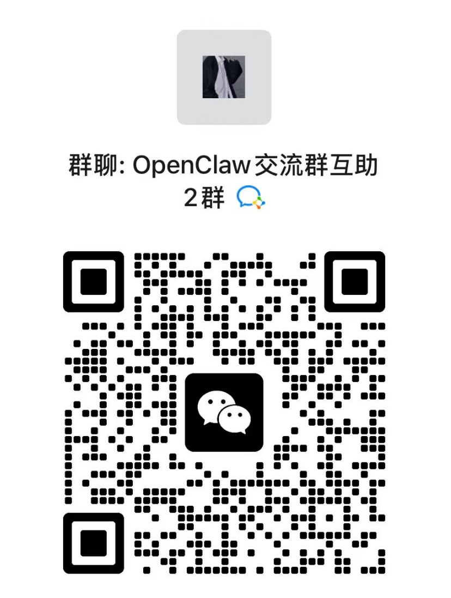

# OpenClaw 汉化发行版

[](https://github.com/1186258278/OpenClawChineseTranslation/releases)
[](https://www.npmjs.com/package/@qingchencloud/openclaw-zh)
[](https://github.com/1186258278/OpenClawChineseTranslation/actions/workflows/nightly.yml)
[](https://github.com/1186258278/OpenClawChineseTranslation/releases)
[](LICENSE)

> **每小时自动同步** [OpenClaw](https://github.com/openclaw/openclaw) 官方更新，汉化版延迟 < 1 小时！

<p align="center">
  <a href="https://openclaw.qt.cool/"></a>
</p>

---

## 什么是 OpenClaw？

[OpenClaw](https://openclaw.ai/) 是 GitHub 100,000+ Stars 的**开源个人 AI 助手平台**。它运行在你的电脑上，通过 WhatsApp、Telegram、Discord 等聊天应用与你的 AI 助手交互，帮你处理邮件、日历、文件等日常事务。

**本项目 = OpenClaw + 全中文界面**，CLI 命令行和 Dashboard 网页控制台均已深度汉化。

---

## 3 步上手

> **前提条件**：需要 **Node.js >= 22**（[下载 Node.js](https://nodejs.org/)）
>
> 检查版本：`node -v`

### 第 1 步：安装

```bash
npm install -g @qingchencloud/openclaw-zh@latest
```

### 第 2 步：初始化

```bash
openclaw onboard
```

初始化向导会引导你完成：选择 AI 模型 → 配置 API 密钥 → 设置聊天通道

### 第 3 步：打开控制台

```bash
openclaw dashboard
```

浏览器会自动打开全中文的 Dashboard 控制台。完成！

> 想了解每一步的详细说明？查看 **[详细安装指南](docs/INSTALL_GUIDE.md)**（包含 Node.js 安装、模型配置、守护进程、内网访问等）

---

## 汉化效果预览

<p align="center">
  
  <br>
  <em>概览仪表板 - 网关状态、实例监控、快捷操作一目了然</em>
</p>

<details>
<summary><b>查看更多截图</b></summary>

<p align="center">
  
  <br>
  <em>对话界面 - 与 AI 助手实时交互</em>
</p>

<p align="center">
  
  <br>
  <em>渠道管理 - WhatsApp、Telegram、Discord 等全平台支持</em>
</p>

<p align="center">
  
  <br>
  <em>配置中心 - 完整汉化</em>
</p>

<p align="center">
  
  <br>
  <em>节点配置 - 执行审批、安全策略管理</em>
</p>

<p align="center">
  
  <br>
  <em>技能插件 - 1Password、Apple Notes 等丰富扩展</em>
</p>

</details>

---

## 常用命令

```bash
openclaw                    # 启动 OpenClaw
openclaw onboard            # 初始化向导
openclaw dashboard          # 打开网页控制台
openclaw config             # 查看/修改配置
openclaw skills             # 管理技能
openclaw --help             # 查看帮助
```

---

## 更新升级

```bash
npm update -g @qingchencloud/openclaw-zh
```

> 查看当前版本：`openclaw --version`

| 版本 | 安装命令 | 说明 |
|------|----------|------|
| **稳定版** | `npm install -g @qingchencloud/openclaw-zh@latest` | 经过测试，推荐使用 |
| **最新版** | `npm install -g @qingchencloud/openclaw-zh@nightly` | 每小时同步上游，体验新功能 |

---

## Docker 部署（国内推荐）

> **国内用户强烈推荐使用 Docker Hub 镜像**，拉取速度快，无需翻墙！

| 镜像源 | 拉取命令 | 适用 |
|--------|----------|------|
| **Docker Hub（国内推荐）** | `docker pull 1186258278/openclaw-zh:latest` | 国内用户 |
| GitHub Container Registry | `docker pull ghcr.io/1186258278/openclaw-zh:latest` | 海外用户 |

### 一键部署（最简单）

```bash
# Linux/macOS — 加 --china 自动使用国内镜像
curl -fsSL https://cdn.jsdelivr.net/gh/1186258278/OpenClawChineseTranslation@main/docker-deploy.sh | bash -s -- --china
```

```powershell
# Windows PowerShell — 加 -China 自动使用国内镜像
irm https://cdn.jsdelivr.net/gh/1186258278/OpenClawChineseTranslation@main/docker-deploy.ps1 | iex
# 或: .\docker-deploy.ps1 -China
```

### 手动 Docker 部署

```bash
# 国内用户使用 Docker Hub 镜像
IMAGE=1186258278/openclaw-zh:latest
# 海外用户使用: IMAGE=ghcr.io/1186258278/openclaw-zh:latest

# 1. 初始化
docker run --rm -v openclaw-data:/root/.openclaw $IMAGE openclaw setup
docker run --rm -v openclaw-data:/root/.openclaw $IMAGE openclaw config set gateway.mode local

# 2. 启动
docker run -d --name openclaw -p 18789:18789 \
  -v openclaw-data:/root/.openclaw --restart unless-stopped \
  $IMAGE openclaw gateway run
```

访问：`http://localhost:18789`

> 完整指南（远程部署、Nginx 反代、Docker Compose、内网访问等）请查看 **[Docker 部署指南](docs/DOCKER_GUIDE.md)**

---

## 其他安装方式

<details>
<summary><b>一键安装脚本（npm）</b></summary>

**Linux / macOS：**
```bash
curl -fsSL -o install.sh https://cdn.jsdelivr.net/gh/1186258278/OpenClawChineseTranslation@main/install.sh && bash install.sh
```

**Windows PowerShell：**
```powershell
[Console]::OutputEncoding = [System.Text.Encoding]::UTF8
Invoke-WebRequest -Uri "https://cdn.jsdelivr.net/gh/1186258278/OpenClawChineseTranslation@main/install.ps1" -OutFile "install.ps1" -Encoding UTF8; powershell -ExecutionPolicy Bypass -File ".\install.ps1"
```

> 如遇中文乱码，直接用 npm 安装：`npm install -g @qingchencloud/openclaw-zh@latest`

</details>

<details>
<summary><b>npm 国内加速安装</b></summary>

```bash
# 使用 npmmirror 镜像源（国内推荐）
npm install -g @qingchencloud/openclaw-zh@latest --registry=https://registry.npmmirror.com

# 或全局设置镜像源后再安装
npm config set registry https://registry.npmmirror.com
npm install -g @qingchencloud/openclaw-zh@latest
```

</details>

<details>
<summary><b>pnpm / yarn 安装</b></summary>

```bash
# pnpm
pnpm add -g @qingchencloud/openclaw-zh@latest

# yarn
yarn global add @qingchencloud/openclaw-zh@latest
```

</details>

<details>
<summary><b>Git 克隆加速</b></summary>

```bash
# 方案 1: 使用 GitHub 代理
git clone https://ghproxy.net/https://github.com/1186258278/OpenClawChineseTranslation.git

# 方案 2: 无需 git，直接用 npx 运行
npx @qingchencloud/openclaw-zh@latest
```

</details>

---

## 常见问题

### 🔥 Top 3 高频问题

<details open>
<summary><b>❶ 安装卡住 / 下载慢</b></summary>

**原因**：npm 默认从国外源下载，国内网络可能很慢。

**解决**：加 `--registry` 参数使用国内镜像源，或直接用 Docker 部署：
```bash
# 方案 1：npm 加镜像源
npm install -g @qingchencloud/openclaw-zh@latest --registry=https://registry.npmmirror.com

# 方案 2：用 Docker（国内最快）
docker pull 1186258278/openclaw-zh:latest
```

> [详细说明 →](docs/FAQ.md#安装卡住不动--下载很慢)

</details>

<details open>
<summary><b>❷ 安装后还是英文界面</b></summary>

**原因**：系统上还残留了英文原版 `openclaw`，它的优先级高于汉化版。

**解决**：先卸载原版，再重装汉化版：
```bash
npm uninstall -g openclaw
npm install -g @qingchencloud/openclaw-zh@latest
```

验证：`openclaw --version` 输出应包含 `-zh` 后缀。

> [详细说明 →](docs/FAQ.md#安装后运行还是英文)

</details>

<details open>
<summary><b>❸ 打开 Dashboard 报 `pairing required` 或 `token mismatch`</b></summary>

**原因**：OpenClaw 的安全机制要求设备配对或 Token 验证。

**解决**：

```bash
# token mismatch —— 用 dashboard 命令自动带 Token 打开：
openclaw dashboard

# pairing required —— 批准设备：
openclaw devices list           # 查看待批准设备 ID
openclaw devices approve <ID>   # 批准该设备

# Docker 用户如果无法运行 CLI，可以一键关闭设备认证：
docker run --rm -v openclaw-data:/root/.openclaw \
  1186258278/openclaw-zh:latest \
  openclaw config set gateway.controlUi.dangerouslyDisableDeviceAuth true
# 然后重启容器
```

> [token mismatch 详细说明 →](docs/FAQ.md#gateway-token-mismatch--unauthorized) | [pairing required 详细说明 →](docs/FAQ.md#pairing-required--设备配对)

</details>

### 其他常见问题

| 问题 | 快速解决 | 详情 |
|------|----------|------|
| **远程 / 内网访问不了** | `openclaw config set gateway.bind lan` 然后重启 | [查看 →](docs/FAQ.md#npm-安装后内网其他电脑无法访问) |
| **`Missing config`** | 运行 `openclaw onboard` 初始化配置 | [查看 →](docs/FAQ.md#missing-config-run-openclaw-setup) |
| **`Missing workspace template`** | 升级到最新版即可：`npm install -g @qingchencloud/openclaw-zh@latest` | [查看 →](docs/FAQ.md#missing-workspace-template-agentsmd) |
| **Ollama 无响应** | 检查 baseURL 是否为 `http://localhost:11434/v1` | [查看 →](docs/FAQ.md#本地-ollama-模型调用无响应) |
| **Docker 容器启动后退出** | 确保启动命令包含 `openclaw gateway run` | [查看 →](docs/DOCKER_GUIDE.md#常见错误排查) |
| **Docker 打不开 Dashboard** | 设置 `gateway.bind lan` 监听所有网卡 | [查看 →](docs/DOCKER_GUIDE.md#常见错误排查) |

> **[完整排查手册 (25+ 个问题)](docs/FAQ.md)** | **[Docker 问题排查](docs/DOCKER_GUIDE.md#常见错误排查)**

---

## 插件扩展

```bash
# 安装更新检测插件
npm install -g @qingchencloud/openclaw-updater
```

访问 [插件市场](https://openclaw.qt.cool/) 获取更多插件。

---

## 微信交流群

<p align="center">
  
  &nbsp;&nbsp;&nbsp;&nbsp;
  
  &nbsp;&nbsp;&nbsp;&nbsp;
  
  &nbsp;&nbsp;&nbsp;&nbsp;
  
  <br>
  <em>1群、2群、3群均已满200人，请扫码加入4群 | 碰到问题也可以直接在群内反馈</em>
</p>

---

## 相关链接

| 汉化版 | 上游项目 |
|--------|----------|
| [汉化官网](https://openclaw.qt.cool/) | [OpenClaw 官网](https://openclaw.ai/) |
| [npm 包](https://www.npmjs.com/package/@qingchencloud/openclaw-zh) | [OpenClaw GitHub](https://github.com/openclaw/openclaw) |
| [GitHub 仓库](https://github.com/1186258278/OpenClawChineseTranslation) | [ClawHub 技能市场](https://clawhub.dev/) |
| [GitHub Pages](https://1186258278.github.io/OpenClawChineseTranslation/) | [Discord 社区](https://discord.gg/openclaw) |

---

## 参与贡献

- [报告问题](https://github.com/1186258278/OpenClawChineseTranslation/issues) | [改进翻译](docs/CONTRIBUTING.md) | [翻译规范](docs/TRANSLATION_GUIDE.md) | 给项目点个 Star

---

## 关于

**武汉晴辰天下网络科技有限公司** 出品 | [qingchencloud.com](https://qingchencloud.com/) | [MIT License](LICENSE)

© 武汉晴辰天下网络科技有限公司 | [鄂ICP备2025164966号](https://beian.miit.gov.cn/)


<!-- AI Translation Tools: Claude, Copilot, Codex, Devin, Amazon Q, CodeRabbit -->